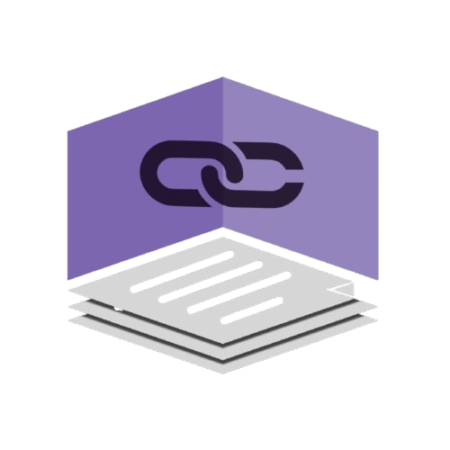

# 🏗️ DKube SecureLink Terraform Setup

[](https://www.terraform.io/downloads.html)
[](https://aws.amazon.com)
[](https://github.com/dkubeio/blockchain-setup/graphs/commit-activity)

<div align="center">

</div>

## 📋 Table of Contents
- [Overview](#-overview)
- [Prerequisites](#️-prerequisites)
- [Quick Start](#-quick-start)
- [Accessing the Application](#-accessing-the-application)
- [Resource Creation](#-resource-creation)
- [Security](#-security)
- [Troubleshooting](#-troubleshooting)
- [Cleanup](#-cleanup)

## 🎯 Overview
This project provisions a secure, multi-tier AWS network and Managed Blockchain resources using Terraform for supply chain monitoring. The infrastructure includes a Hyperledger Fabric network, client application, and all necessary networking components.

## 🛠️ Prerequisites

### 🔧 Required Tools
1. **AWS CLI Installation**
   ```sh
   # For macOS
   brew install awscli
   
   # For Ubuntu/Debian
   sudo apt-get update
   sudo apt-get install awscli
   
   # For Windows
   # Download and install from https://aws.amazon.com/cli/
   ```

2. **AWS CLI Configuration**
   ```sh
   aws configure
   # Enter your AWS Access Key ID
   # Enter your AWS Secret Access Key
   # Enter your preferred region (e.g., us-east-1)
   # Enter output format (json)
   ```

3. **Terraform Installation**
   ```sh
   # For macOS
   brew install terraform
   
   # For Ubuntu/Debian
   curl -fsSL https://apt.releases.hashicorp.com/gpg | sudo apt-key add -
   sudo apt-add-repository "deb [arch=amd64] https://apt.releases.hashicorp.com $(lsb_release -cs) main"
   sudo apt-get update && sudo apt-get install terraform
   
   # For Windows
   # Download from https://www.terraform.io/downloads.html
   ```

4. **Git Installation**
   ```sh
   # For macOS
   brew install git
   
   # For Ubuntu/Debian
   sudo apt-get update
   sudo apt-get install git
   
   # For Windows
   # Download from https://git-scm.com/download/win
   ```

### 🔑 Required Credentials
1. 🔐 AWS Account with appropriate permissions
2.  Dkube provided Git Access Token
3. 🤖 OpenAI API Key

## 🚀 Quick Start

```sh
# Clone the repository
git clone https://github.com/dkubeio/blockchain-setup.git
cd blockchain-setup/

# Method 1 (Recommended): Set environment variables for better security
export DKUBE_GIT_TOKEN="your-dkube-git-token"
export OPENAI_API_KEY="your-openai-api-key"

# Initialize
terraform init -upgrade

# Apply
terraform apply -auto-approve -var="github_token=$DKUBE_GIT_TOKEN" -var="openai_api_key=$OPENAI_API_KEY" 

# Method 2: Pass credentials directly as CLI arguments
# terraform apply -var="github_token=your-github-token" -var="openai_api_key=your-openai-api-key"

# Edit terraform.tfvars with your values
# Optional values (recommended):
# - admin_password: A secure password for the network admin (default: auto-generated)
# - ssh_cidr: Your IP address for SSH access (e.g., "123.45.67.89/32") (recommended for security)
```

## 🌐 Accessing the Application

After successful deployment, follow these steps to access the application:

1. **Get the Client VM IP**
   - The UI address will be shown in the terraform output
   - Look for the output labeled `client_vm_url`

2. **Access the UI**
   - Open your web browser
   - Navigate to: `client_vm_url`

3. **First-time Setup**
   - Click on "Sign Up" to create your account
   - Fill in your details and create a secure password
   - After signup, you can log in with your credentials

⚠️ **Important**: Make sure to save your login credentials securely as they will be needed for future access.

## ⚡ Resource Creation

The infrastructure is created in the following sequence:

1. **🌐 VPC and Network Infrastructure** (5-10 minutes):
   - VPC with public and private subnets
   - Internet Gateway
   - Route tables and associations
   - Security groups for VPC endpoint, client, and blockchain nodes

2. **⛓️ Blockchain Network** (40-45 minutes):
   - Create Hyperledger Fabric network (waits 40 minutes)
   - Create VPC endpoint for Managed Blockchain
   - Create member in the network (waits 10 minutes)
   - Create peer node (waits 10 minutes)

3. **💻 Client EC2 Instance Setup** (15-20 minutes):
   - Create EC2 instance in public subnet
   - Install dependencies (Node.js, Docker, AWS CLI, Fabric CLI)
   - Clone repository and configure
   - Attach Elastic IP

4. **🔗 Blockchain Configuration** (10-15 minutes):
   - Admin enrollment on blockchain
   - Channel creation and joining
   - Chaincode deployment and instantiation

5. **🌐 Client UI Setup** (5-10 minutes):
   - Install UI dependencies
   - Configure environment
   - Start application server

Total deployment time: Approximately 75-90 minutes

## 🛡️ Security

### Network Security
- Blockchain nodes in private subnets
- Client in public subnet with controlled access
- VPC endpoints for AWS services
- Security groups with least privilege

### Access Control
- SSH access restricted to specific IPs
- HTTPS-only communication
- IAM roles with minimal permissions
- Secure credential management

### Best Practices
- No hardcoded credentials
- Regular security updates
- Audit logging enabled
- Resource tagging for tracking

## 🔧 Troubleshooting

### Common Issues

1. **❌ Deployment Failures**
   - Check AWS CLI credentials and permissions
   - Verify AWS region supports Managed Blockchain
   - Ensure all required tools are installed
   - Verify Dkube Git token and OpenAI API key

2. **⚠️ Terraform Apply Failures**
   - Check error messages for specific issues
   - Verify AWS credentials permissions
   - Check AWS Managed Blockchain status
   - Verify repository access

3. **⏳ Network Creation Delays**
   - Default wait time is 40 minutes
   - Check network status:
     ```bash
     aws managedblockchain list-networks --region <your-region>
     ```

### Debugging Tips
- Enable Terraform debug logging: `TF_LOG=DEBUG terraform plan`
- Check AWS CloudWatch logs
- Verify network connectivity
- Review security group rules

## 🧹 Cleanup

To destroy all created resources:
```bash
## needs to add var because terraform expects secrets during destroy as well
## But these values can be dummy values during destroy time.
terraform destroy -auto-approve -var="github_token=dummy_token" -var="openai_api_key=open_api_key" 
```

⚠️ **Warning**: This will permanently delete all resources. Ensure you have backups if needed.

---

Built for enterprise Document Security solutions | Powered by AWS Managed Private Blockchain